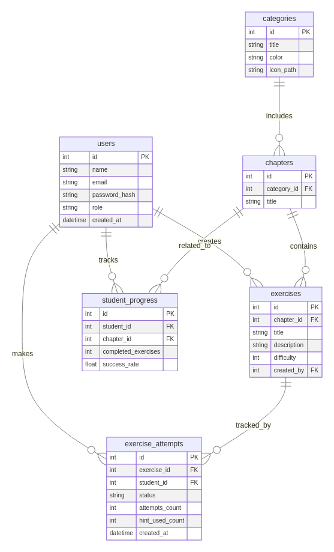

# Interactive Learning Backend

This is the backend for the Interactive Learning platform, built with **Express.js**, **Prisma ORM**, and **PostgreSQL**.

---

## Database Structure

The database is managed using **Prisma**. Below is the relational schema:



### Tables

#### 1. `users`
- `id` (PK)
- `name`
- `email` (UNIQUE)
- `password_hash`
- `role` (enum: `'student' | 'teacher'`)
- `created_at`

---

#### 2. `categories`
- `id` (PK)
- `title` (e.g. MATH, LOGIC)
- `color` (hex, for UI)
- `icon_path` (for UI icons)

---

#### 3. `chapters`
- `id` (PK)
- `category_id` (FK → categories.id)
- `title`

---

#### 4. `exercises`
- `id` (PK)
- `chapter_id` (FK → chapters.id)
- `title`
- `description`
- `difficulty` (1–5)
- `created_by` (FK → users.id, only teachers)

---

#### 5. `exercise_attempts`
- `id` (PK)
- `exercise_id` (FK → exercises.id)
- `student_id` (FK → users.id)
- `status` (`'passed' | 'failed'`)
- `attempts_count`
- `hint_used_count`
- `created_at`

---

#### 6. `student_progress`
- `id` (PK)
- `student_id` (FK → users.id)
- `chapter_id` (FK → chapters.id)
- `completed_exercises`
- `success_rate`

---

> 💡 Note:
- One `User` (Teacher) ➝ many `Exercise`s.
- One `User` (Student) ➝ many `ExerciseResult`s.
- Each `Exercise` ➝ belongs to one Teacher.
- Each `ExerciseResult` ➝ connects one Student to one Exercise.

---

## 🔧 Setup Instructions

1. Clone the backend branch:
```bash
git clone -b backend https://github.com/YouriLangh/InteractiveLearning.git
```

2. Install dependencies:
```bash
npm install
```

3. Setup your `.env` file (ask me for the Prisma DB API key):
```env
DATABASE_URL="your_postgres_url_here"
PORT=5000
```

4. Run Prisma migrations and generate client:
```bash
npx prisma migrate dev --name init
npx prisma generate
```

5. Start the development server:
```bash
npm run dev
```

---

## API Endpoints

### 🔐 Auth
- `POST /api/auth/signup` — register as teacher or student.
- **Request Body:**
  ```json
  {
    "name": "Firas",
    "email": "firas@example.com",
    "password": "supersecure",
    "role": "STUDENT"
  }
  ```

- `POST /api/auth/login` — authenticate and receive token.
- **Request Body:**
  ```json
  {
    "email": "firas@example.com",
    "password": "supersecure"
  }
  ```
---
  
  ##  Prisma Notice
  
  This backend uses **Prisma** as the ORM. Contact me directly if you need the **DATABASE_URL API key** to connect.
  
  ---
