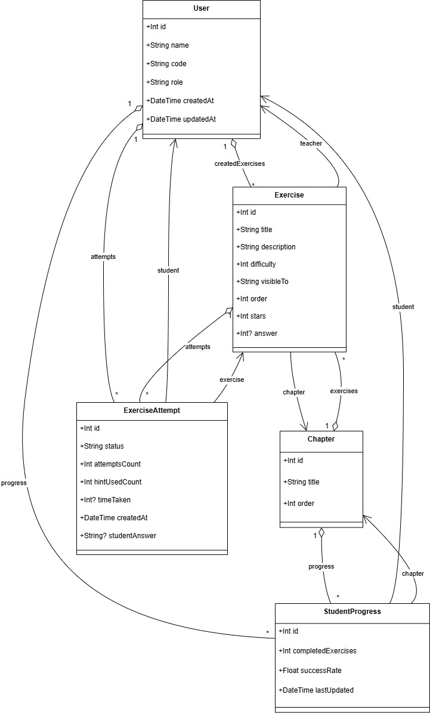

# Interactive Learning Backend

This is the backend for the Interactive Learning platform, built with **Express.js**, **Prisma ORM**, and **SQLite** (configurable).

---

## Database Structure

The database is managed using **Prisma**. Below is the relational schema:



### Tables

#### 1. `User`
- `id` (PK)
- `name`
- `email` (UNIQUE)
- `passwordHash`
- `role` (string: e.g. 'STUDENT' | 'TEACHER')
- `createdAt`

---

#### 2. `Category`
- `id` (PK)
- `title` (e.g. MATH, LOGIC)
- `color` (hex, for UI)
- `iconPath` (for UI icons)
- `order` (for custom ordering)

---

#### 3. `Chapter`
- `id` (PK)
- `categoryId` (FK → Category.id)
- `title`
- `order` (for custom ordering)

---

#### 4. `Exercise`
- `id` (PK)
- `chapterId` (FK → Chapter.id)
- `title`
- `description`
- `difficulty` (1–5)
- `createdBy` (FK → User.id, only teachers)
- `visibleTo` (string, for visibility control)
- `order` (for custom ordering)
- `stars` (for star rating display)

---

#### 5. `ExerciseAttempt`
- `id` (PK)
- `exerciseId` (FK → Exercise.id)
- `studentId` (FK → User.id)
- `status` (string: e.g. 'PASSED' | 'FAILED')
- `attemptsCount`
- `hintUsedCount`
- `createdAt`
- `studentAnswer` (nullable string)

---

#### 6. `StudentProgress`
- `id` (PK)
- `studentId` (FK → User.id)
- `chapterId` (FK → Chapter.id)
- `completedExercises`
- `successRate`
- `lastUpdated`

---

> 💡 Note:
> - One `User` (Teacher) ➝ many `Exercise`s.
> - One `User` (Student) ➝ many `ExerciseAttempt`s.
> - Each `Exercise` ➝ belongs to one Teacher.
> - Each `ExerciseAttempt` ➝ connects one Student to one Exercise.

---

## 🔧 Setup Instructions

1. Clone the backend branch:
```bash
git clone -b backend https://github.com/YouriLangh/InteractiveLearning.git
```

2. Install dependencies:
```bash
npm install
```

3. Setup your `.env` file (ask me for the Prisma DB API key):
```env
DATABASE_URL="file:./dev.db"
PORT=5000
JWT_SECRET=supersecret
```

4. Run Prisma migrations and generate client:
```bash
npx prisma migrate dev --name init
npx prisma generate
```

5. Ensure you have python on your local device and install the python dependencies (for CV):
```bash
pip install -r requirements.txt
```

6. Start the development server:
```bash
npm run dev
```

---

## API Endpoints

### 🔐 Auth
- `POST /api/auth/signup` — register as teacher or student.
- **Request Body:**
  ```json
  {
    "name": "Firas",
    "email": "firas@example.com",
    "password": "supersecure",
    "role": "STUDENT"
  }
  ```

- `POST /api/auth/login` — authenticate and receive token.
- **Request Body:**
  ```json
  {
    "email": "firas@example.com",
    "password": "supersecure"
  }
  ```

### 👤 User
- `GET /api/user/profile` — get current user profile (auth required)
- `PUT /api/user/profile` — update user profile (auth required)
  - **Request Body:**
    ```json
    {
      "name": "New Name",
      "email": "new@email.com"
    }
    ```

### 📚 Categories
- `GET /api/category/` — get all categories
- `POST /api/category/` — create category (teacher only)
- `PUT /api/category/:id` — update category (teacher only)
- `DELETE /api/category/:id` — delete category (teacher only)
- `PUT /api/category/:id/order` — update category order (teacher only)
  - **Request Body:**
    ```json
    { "order": 2 }
    ```

### 📖 Chapters
- `GET /api/chapter/:id` — get chapter by id
- `GET /api/chapter/category/:categoryId` — get chapters by category
- `POST /api/chapter/` — create chapter (teacher only)
- `PUT /api/chapter/:id` — update chapter (teacher only)
- `DELETE /api/chapter/:id` — delete chapter (teacher only)
- `PUT /api/chapter/:id/order` — update chapter order (teacher only)
  - **Request Body:**
    ```json
    { "order": 3 }
    ```

### 📝 Exercises
- `GET /api/exercise/:id` — get exercise by id
- `GET /api/exercise/chapter/:chapterId` — get exercises by chapter
- `POST /api/exercise/` — create exercise (teacher only)
- `PUT /api/exercise/:id` — update exercise (teacher only)
- `DELETE /api/exercise/:id` — delete exercise (teacher only)
- `PUT /api/exercise/:id/order` — update exercise order (teacher only)
  - **Request Body:**
    ```json
    { "order": 1 }
    ```
- `PUT /api/exercise/:id/visibility` — update exercise visibility (teacher only)
  - **Request Body:**
    ```json
    { "visibleTo": "ALL" }
    ```
- `PUT /api/exercise/:id/stars` — update exercise stars (teacher only)
  - **Request Body:**
    ```json
    { "stars": 5 }
    ```

### 🎯 Exercise Attempts
- `POST /api/exercise-attempt/` — create new attempt (student only)
  - **Request Body:**
    ```json
    { "exerciseId": "1" }
    ```
- `GET /api/exercise-attempt/:id` — get specific attempt
- `GET /api/exercise-attempt/exercise/:exerciseId` — get attempts by exercise (student only)
- `GET /api/exercise-attempt/student/:studentId` — get attempts by student (teacher or self)
- `PUT /api/exercise-attempt/:id/answer` — submit student answer
  - **Request Body:**
    ```json
    { "answer": "42", "isCorrect": true }
    ```

### 📈 Student Progress
- `GET /api/student-progress/:studentId/chapter/:chapterId` — get student progress (teacher or self)
- `PUT /api/student-progress/:studentId/chapter/:chapterId` — update student progress (student only)
  - **Request Body:**
    ```json
    { "completedExercises": 5, "successRate": 0.8 }
    ```

---

##  Prisma Notice

This backend uses **Prisma** as the ORM. Contact me directly if you need the **DATABASE_URL API key** to connect.

---
